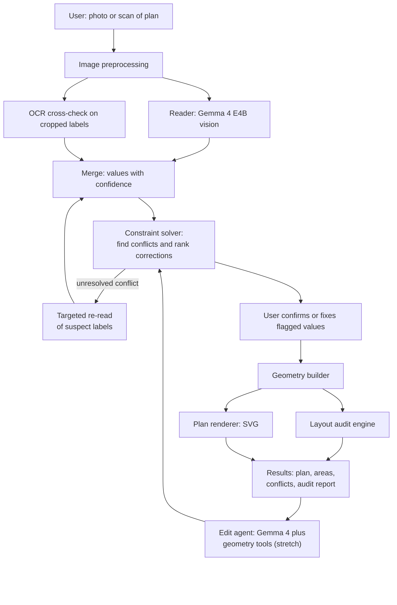
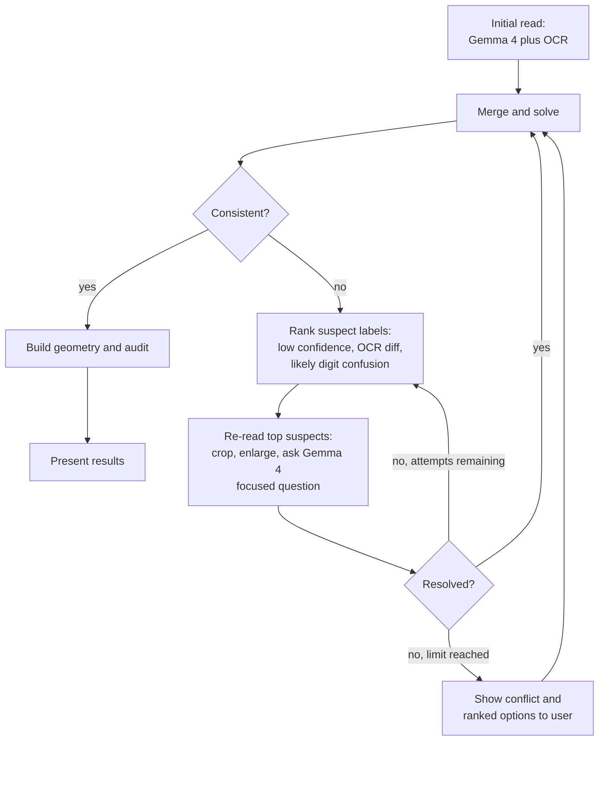

# Sketch-to-Space

**Verified floor plans from hand-drawn sketches: read, cross-check, correct, audit.**

> Hacktober Fest | Open Source AI Hackathon | Track: **Best Use of Gemma 4**

---

## Table of Contents

1. [Project Name](#1-project-name)
2. [Problem Statement](#2-problem-statement)
3. [Project Overview](#3-project-overview)
4. [Proposed Solution](#4-proposed-solution)
5. [Objectives](#5-objectives)
6. [Target Users / Use Case](#6-target-users--use-case)
7. [Open-Source AI Technology Selected](#7-open-source-ai-technology-selected)
8. [Why This Technology Was Selected](#8-why-this-technology-was-selected)
9. [AI's Role in the System](#9-ais-role-in-the-system)
10. [System Architecture](#10-system-architecture)
11. [Component-Level Architecture](#11-component-level-architecture)
12. [Data / Information Flow](#12-data--information-flow)
13. [Agentic Workflow](#13-agentic-workflow)
14. [Technology Stack](#14-technology-stack)
15. [Expected Features](#15-expected-features)
16. [Implementation Approach](#16-implementation-approach)
17. [Expected Final Output](#17-expected-final-output)
18. [Future Scope / Scalability](#18-future-scope--scalability)
19. [Open-Source Dependencies / Components](#19-open-source-dependencies--components)
20. [Expected Challenges and Mitigation](#20-expected-challenges-and-mitigation)

---

## 1. Project Name

**Sketch-to-Space**

*Tagline:* A floor-plan checker that finds the dimension that does not add up, before it becomes a construction mistake.

*Track:* Best Use of Gemma 4 (Gemma 4 E4B is the core model of the system).

---

## 2. Problem Statement

Hand-drawn floor plans, and old paper plans that exist only as scans or photos, are still a common starting point for renovation, purchase decisions, small construction jobs and architecture coursework. They almost always contain **dimension errors**: a digit written unclearly, a missing measurement, room widths that do not add up to the overall wall length, or a wall that never closes into a room.

These errors are usually discovered late (during construction, furnishing or valuation), when they are expensive to fix.

Existing tools do not solve this well:

- **Sketch-to-digital converters** focus on turning an image into a clean plan or a 3D model. They trust the numbers they read and do not check whether the numbers agree with each other.
- **General AI models**, when asked to read a plan, can misread a single digit and then report a wrong area with full confidence. Nothing in the pipeline catches it.
- **Manual checking** means re-measuring or re-adding every dimension by hand, which people rarely do.

The core problem: **a plan can be read "successfully" and still be wrong, and nothing tells the user which number to doubt.**

---

## 3. Project Overview

Sketch-to-Space takes a photo or scan of a floor plan that has dimensions written on it and produces:

1. A clean digital plan.
2. Room areas and totals, calculated by code and not by the AI.
3. A list of **dimension conflicts**, each with ranked suggested corrections.
4. A **layout audit** (room access, door clearance, ventilation, furniture fit, accessibility).

A hand-drawn plan repeats information. For example, the room widths along a wall must add up to the overall width written for that wall, and the walls of a room must close into a shape. Sketch-to-Space uses this built-in redundancy as a **checksum** on what the AI read.

**Example.** A sketch states an overall width of 26'0" on the north wall. The living room reads 14'0" and the bedroom reads 11'6" along the same wall, which adds up to 25'6". The system reports:

```
Conflict on the north wall:
  rooms add up to 25'6", overall width says 26'0"
  (difference 6").

Most likely explanations (ranked):
  1. Wall thickness not included in the room dimensions
     (difference is plausible for an interior wall)
  2. Bedroom width read as 11'6" but may be 12'0"
     (digit 1 vs 2 / 6 vs 0 confusion)
  3. Overall width may actually be 25'6"

Please confirm one option.
```

The system never silently picks an answer. It shows the evidence and lets the user decide.

---

## 4. Proposed Solution

Sketch-to-Space is a **read, verify, audit, edit** pipeline in which the AI and deterministic code have clearly separated jobs.

| Stage | Done by | What happens |
|---|---|---|
| **Read** | Gemma 4 E4B (vision) plus an OCR cross-check | Turns the photo into structured data: rooms, walls, openings, labels and written dimensions, with a confidence for each value |
| **Verify** | Constraint solver (no AI) | Uses the plan's redundancy to find contradictions and proposes the smallest likely correction |
| **Audit** | Rule engine (no AI) | Checks access between rooms, door swings, ventilation, furniture fit, accessibility |
| **Edit** (stretch) | Gemma 4 E4B calling geometry tools | Applies plain-language edits; the solver and audit re-run so an edit cannot produce an invalid plan |

### What makes it different

1. **It verifies instead of only converting.** The main contribution is turning the plan's own redundancy into error detection and **ranked minimal corrections**, with the user confirming each fix.
2. **The AI never does the math.** All areas, sums and rule checks are computed by code, so a misread number becomes a visible conflict instead of a confident wrong answer.
3. **Error localisation.** When something does not add up, the system narrows down *which* label is the likely culprit, using read confidence, an independent OCR reading and common handwriting confusions (for example 1 vs 7, 5 vs 6, 3 vs 8).
4. **Fully local and open-weight.** The system runs on a consumer laptop (6 GB VRAM) with Gemma 4 E4B, so private plans never leave the user's device.
5. **Measurable.** Because errors can be injected into synthetic sketches, detection and correction accuracy can be reported with numbers.

### Related work and how we differ

To the best of our knowledge at the time of writing:

- **Sketch2BIM** (a multi-agent, human-in-the-loop pipeline from hand-drawn plans to 3D BIM models) uses annotated dimensions to scale the layout, and relies on a proprietary model for extraction. Our focus is different: detecting and correcting contradictions between the dimensions themselves, with open-weight models running locally.
- **SIM 2.0** (floor-plan vectorisation using a vision-language model and self-consistency) targets image-to-vector conversion rather than dimension verification.
- **Blueprint-analysis services** extract rooms and dimensions with a vision-language model, and their own documentation advises users to verify the extracted dimensions against the original. Our system is built to do that verification.

We will keep this section updated if we find closer prior work.

---

## 5. Objectives

1. Convert a photo of a dimensioned hand-drawn floor plan into structured, machine-readable data.
2. Detect dimension conflicts using constraint solving, and **localise** the most likely misread label.
3. Propose **ranked corrections** and require user confirmation before changing any value.
4. Compute all areas and totals deterministically in code.
5. Audit the layout against a configurable rule pack and report issues with the exact location.
6. Run end-to-end on a laptop with 6 GB of GPU memory using a quantised open-weight model.
7. Support **plain-language editing** that preserves validity (stretch goal).

**Evaluation metrics we will report** (measured on synthetic and hand-drawn test plans):

| Metric | Meaning |
|---|---|
| Label read accuracy | Share of dimension labels read correctly, before and after cross-checking |
| Conflict detection recall / precision | Share of injected errors flagged, and share of flags that were real |
| Correction accuracy (top-1 / top-3) | Share of conflicts where the true value is among the suggested fixes |
| Area correctness | Exact match of computed areas against ground truth, given correct inputs |
| Latency and memory | Time per plan and peak GPU/RAM use on the target laptop |

---

## 6. Target Users / Use Case

| User | Use case |
|---|---|
| Homeowners and renters | Check a seller's or landlord's hand-drawn plan before buying, renting or renovating |
| Architecture and civil engineering students | Verify coursework plans and learn to spot dimensioning mistakes |
| Small builders and contractors | Digitise client sketches and catch errors before quoting |
| Anyone digitising old paper plans | Turn legacy drawings into verified, editable plans |

**Primary use case:** a user photographs a dimensioned sketch and, within seconds, sees a clean plan with every doubtful number highlighted and explained.

---

## 7. Open-Source AI Technology Selected

**Primary model: Gemma 4 E4B (4-bit quantised)**, an open-weight multimodal model from Google DeepMind released under the Apache 2.0 licence.

It is run locally through an open-source inference runtime (Ollama or llama.cpp; the final choice depends on which one handles Gemma 4's image input best on our hardware).

**Supporting open-source components**

| Component | Purpose |
|---|---|
| OCR engine (PaddleOCR or docTR) | Independent second reading of each dimension label |
| OR-Tools CP-SAT (or Z3) | Constraint solving for dimension consistency and minimal correction |
| Shapely, NetworkX | Geometry and room-connectivity analysis |
| OpenCV | Image cleanup, de-skewing, label cropping |

The model name is a configuration setting. Larger Gemma 4 variants (26B MoE, 31B dense) can be used as an optional accuracy mode on a machine with more GPU memory, with no code changes.

---

## 8. Why This Technology Was Selected

| Requirement | Why Gemma 4 E4B fits |
|---|---|
| Understand a hand-drawn image | Native multimodal (vision) input |
| Drive geometry tools for editing | Support for tool / function calling and reasoning |
| Run on a student laptop | The "effective 4B" edge-class model fits in about 4 to 5 GB when quantised, within a 6 GB GPU |
| Private by design | Plans of people's homes never leave the device |
| Free and unrestricted | Apache 2.0 licence, no API fees, no usage limits |
| Reproducible | Anyone can run the same weights and get the same behaviour |

**Why open-source suits this project.** A floor plan is private data. A local open-weight model gives users privacy, offline use and zero per-use cost, and it lets evaluators inspect and reproduce the exact system.

**Why not a hosted API.** It would send private plans to a third party, add cost and latency, introduce a network dependency in a live demo, and reduce the engineering the track asks for.

**Why a small model is acceptable.** The system is designed so that the model's mistakes are *recoverable*: every read value carries a confidence, is cross-checked by OCR, and is verified by the solver. Correctness comes from the verification layer, not from the model being perfect.

---

## 9. AI's Role in the System

**The AI does:**
- Perception: reading rooms, walls, openings, labels and written dimensions from the image.
- Attaching each dimension to the correct wall or room, with a confidence value.
- Re-reading cropped regions when asked to resolve a suspected misread.
- Explaining conflicts and options in plain language.
- (Stretch) Translating plain-language edit requests into calls to geometry tools.

**The AI does not:**
- Perform any arithmetic, area calculation or sum.
- Decide whether a plan passes a rule.
- Silently change any value.
- Produce the final numbers shown to the user.

This split is the central design principle: **the model understands, code verifies.** Without Gemma 4, the system could not read arbitrary handwritten sketches. Without the verification layer, Gemma 4 alone could not be trusted with the numbers.

---

## 10. System Architecture



**Layers**

1. **Input layer:** upload and cleanup of the image.
2. **Perception layer:** Gemma 4 reading plus OCR cross-check.
3. **Verification layer:** merge, constraint solving and correction ranking.
4. **Geometry and audit layer:** exact geometry, areas and rule checks.
5. **Presentation layer:** web interface and exports.

---

## 11. Component-Level Architecture

| Component | Input | Output | Tool | Why it is needed |
|---|---|---|---|---|
| Preprocessor | Raw photo | Straightened, contrast-normalised image and label crops | OpenCV | Phone photos are skewed, shadowed and low-contrast |
| Reader | Image (and crops) | Structured JSON: rooms, walls, openings, labelled dimensions, confidences | Gemma 4 E4B, constrained JSON output | Understands the drawing and handwriting |
| OCR cross-checker | Cropped label images | Independent text reading and confidence per label | PaddleOCR or docTR | A second opinion catches misreads the model makes |
| Merger | Reader output and OCR output | One reading per label with candidate alternatives and confidence | Python | Disagreements become "uncertain" instead of hidden |
| Constraint solver | Labels, candidates, wall and room relationships | Consistent assignment, or ranked list of minimal corrections | OR-Tools CP-SAT | Detects contradictions and localises the likely misread |
| Geometry builder | Confirmed dimensions and relationships | Exact wall and room geometry | Shapely | Computes true shapes and areas |
| Audit engine | Geometry and rule pack | List of issues with locations | Shapely, NetworkX | Deterministic practical checks |
| Renderer | Geometry and issues | Clean annotated SVG | svgwrite (optional ezdxf for CAD export) | Lets the user compare the plan against their photo |
| Edit agent (stretch) | User instruction and current plan | Modified plan, re-verified | Gemma 4 tool calls | Natural-language editing that cannot break validity |
| Web app | User actions | Upload, overlay review, confirm-fix flow, reports | FastAPI and a simple web front-end | Makes the system usable and demonstrable |

---

## 12. Data / Information Flow

| Step | Data | Example |
|---|---|---|
| 1 | Photo uploaded | `plan.jpg` |
| 2 | Cleaned image and label crops | One crop per written dimension |
| 3 | Reader output | Rooms, walls, adjacency, labels with values and confidence |
| 4 | OCR output | Independent value and confidence per label |
| 5 | Merged readings | Value, alternatives and agreement flag per label |
| 6 | Constraints generated | Wall-sum equalities, closure of room outlines, equal opposite walls |
| 7 | Solver result | Consistent, or a ranked list of minimal corrections |
| 8 | User confirmation | Accept, choose another candidate, or type a value |
| 9 | Geometry and areas | Exact polygons and areas |
| 10 | Audit and render | Issue list and annotated SVG |

**Sample of the structured data passed between stages (illustrative):**

```json
{
  "walls": [
    {
      "id": "north",
      "overall": {
        "value_in": 312,
        "confidence": 0.62,
        "source": ["gemma", "ocr"],
        "agree": false
      },
      "segments": [
        {
          "room": "living",
          "value_in": 168,
          "confidence": 0.91
        },
        {
          "room": "bedroom",
          "value_in": 138,
          "confidence": 0.55,
          "alternatives": [144, 132]
        }
      ]
    }
  ],
  "constraints": [
    "sum(segments of north) + wall_thickness_allowance == overall(north)"
  ],
  "result": {
    "status": "conflict",
    "difference_in": 6,
    "suggestions": [
      {
        "rank": 1,
        "change": "none, difference within wall thickness allowance"
      },
      {
        "rank": 2,
        "change": "bedroom 138 -> 144"
      },
      {
        "rank": 3,
        "change": "overall 312 -> 306"
      }
    ]
  }
}
```

All dimensions are stored internally in one unit (inches) so that feet-inch and metric inputs share the same constraint system.

---

## 13. Agentic Workflow

The system uses a bounded **read, check, re-read** loop, with the model acting as a tool-using agent and the solver as the authority.



**Agent tools (editing, stretch goal):** `resize_room`, `move_wall`, `add_opening`, `remove_opening`, `swap_rooms`, `validate_plan`, `run_audit`.

**Guardrails**
- The re-read loop has a fixed attempt limit.
- Every tool call is followed by solver and audit re-validation.
- If an edit would make the plan inconsistent, it is rejected and the reason is explained.
- No value is changed without being shown to the user.

---

## 14. Technology Stack

| Layer | Technology |
|---|---|
| Vision and language model | Gemma 4 E4B, 4-bit quantised (larger Gemma 4 variants optional) |
| Model runtime | Ollama or llama.cpp (selected after testing image support), with grammar or schema-constrained JSON output |
| OCR | PaddleOCR or docTR |
| Image processing | OpenCV, Pillow |
| Constraint solving | Google OR-Tools (CP-SAT), Z3 as an alternative |
| Geometry and graphs | Shapely, NetworkX |
| Backend | Python, FastAPI, Pydantic for data schemas |
| Frontend | Lightweight web UI with an overlay view of values on the original photo |
| Rendering and export | svgwrite for SVG; optional ezdxf (DXF) and three.js (3D view) |
| Configuration | YAML rule pack and furniture catalogue |
| Deployment | Local execution on a laptop; optional container for reproducibility |

**Execution strategy.** The full pipeline runs locally on a laptop with a 6 GB GPU and 16 GB RAM. No internet connection is required at run time.

---

## 15. Expected Features

**Core (must be completed in the final)**

- Upload a photo or scan of a dimensioned plan.
- Image cleanup and per-label cropping.
- Structured reading with Gemma 4 plus OCR cross-check, with confidence per value.
- Support for feet-inch and metric dimensions.
- Dimension-consistency checking with conflict detection.
- Ranked suggested corrections with user confirmation.
- Deterministic area and total calculations.
- Layout audit: room connectivity, door swing collisions, window-to-floor ratio, basic furniture fit.
- Clean annotated SVG plan with flagged values overlaid.
- Exportable report (conflicts, corrections, areas, audit issues).

**Stretch (only if the core is stable)**

- Plain-language editing through tool calls with automatic re-validation.
- Accessibility checks (door widths, turning space).
- Material quantity estimates from deterministic formulas and an editable price table.
- 3D walkthrough by extruding the walls.
- CAD (DXF) export.

---

## 16. Implementation Approach

The work is ordered so that the biggest risk is tested first.

| Phase | Work | Output |
|---|---|---|
| 1. Reader test (go / no-go) | Run Gemma 4 E4B on a set of dimensioned sketches, measure label read accuracy, test cropped-label reading and the OCR cross-check | Decision on preprocessing, crop strategy and whether a fallback is needed |
| 2. Solver on structured data | Build the constraint system and correction ranking using hand-written structured plans, independent of the reader | Working verification core |
| 3. Integration | Connect the reader and OCR to the solver; implement the re-read loop | End-to-end read, check, correct |
| 4. Geometry and audit | Build exact geometry from confirmed values; implement the rule checks | Areas and audit report |
| 5. Interface | Upload, overlay review, confirm-fix flow, SVG output, report | Demonstrable application |
| 6. Evaluation | Generate sketches from known plans with injected errors and measure the metrics in Section 5 | Reported numbers |
| 7. Stretch | Editing agent, extra checks, 3D and exports | Optional extras |

**Testing and data**
- A **synthetic generator** renders known plans in a hand-drawn style with noise and deliberately inserted errors, giving ground truth for evaluation.
- A set of **real hand-drawn sketches** photographed under different lighting and angles.
- Public floor-plan datasets may be used for room detection experiments if their licences allow it.

**Scope control.** If time runs short, Phases 1 to 5 form the minimum deliverable. Stretch features are dropped first.

**Fallbacks.**
- If E4B reads handwriting poorly, rely more on cropped-label reading and OCR, or switch to a larger Gemma 4 variant through the configuration setting.
- If image input is unstable in one runtime, switch to the other.

---

## 17. Expected Final Output

A working local web application where a user can:

1. Upload a photo of a dimensioned hand-drawn plan.
2. See the plan redrawn cleanly, with every read value overlaid on the original photo and uncertain values highlighted.
3. Review each dimension conflict with the evidence and ranked suggestions, and confirm a fix.
4. Receive computed room areas and total area.
5. Receive a layout audit with the exact location of each issue.
6. Download a report and the clean plan.

**Live demonstration:** a person draws a plan on paper, deliberately writes one wrong dimension, photographs it, and the system finds the contradiction, explains it, and offers corrections.

**Reported results:** the evaluation metrics from Section 5, measured on synthetic and real sketches.

---

## 18. Future Scope / Scalability

- **Larger models:** switch to bigger Gemma 4 variants for higher reading accuracy when more GPU memory is available.
- **More inputs:** multi-storey plans, CAD drawings, scanned printed plans and photos taken at an angle.
- **More rule packs:** region-specific building-rule sets maintained as configuration files.
- **Richer outputs:** DXF and BIM-compatible export, 3D walkthrough, material and cost estimates.
- **Mobile use:** an on-device version with a smaller model for on-site checking.
- **Learning from corrections:** use confirmed user corrections as labelled data to improve reading, with user consent.
- **Extensibility:** the same "read, then verify against internal redundancy" pattern applies to other documents with built-in checksums, such as engineering drawings and tables with totals.

---

## 19. Open-Source Dependencies / Components

| Component | Role | Licence (to be re-verified at implementation) |
|---|---|---|
| Gemma 4 E4B | Vision and language model | Apache 2.0 |
| Ollama / llama.cpp | Local model runtime | MIT |
| PaddleOCR / docTR | OCR cross-check | Apache 2.0 |
| OpenCV | Image processing | Apache 2.0 |
| Google OR-Tools | Constraint solving | Apache 2.0 |
| Z3 (alternative) | Constraint solving | MIT |
| Shapely | Geometry | BSD-3-Clause |
| NetworkX | Graph analysis | BSD-3-Clause |
| FastAPI, Pydantic | Backend and data schemas | MIT |
| svgwrite | SVG rendering | MIT |
| ezdxf (optional) | DXF export | MIT |
| three.js (optional) | 3D view | MIT |

The project itself is intended to be released as open source under a permissive licence (Apache 2.0 or MIT).

---

## 20. Expected Challenges and Mitigation

| Challenge | Risk | Mitigation |
|---|---|---|
| Messy or ambiguous handwriting | Misread digits, especially similar ones (1/7, 5/6, 3/8) | Per-label cropping at higher effective resolution; OCR cross-check; confidence flags; solver-driven re-reads; user confirmation |
| Small model quality (E4B, 4-bit) | Weaker reading than larger models | Verification layer absorbs errors; model is a config setting so larger variants can be swapped in |
| Limited GPU memory (6 GB) | Out-of-memory with image input | Resize and crop images, short prompts, one plan per request, smaller quantisation, partial CPU offload, E2B as fallback |
| Model does not return valid structure | Broken or incomplete JSON | Schema or grammar-constrained decoding; validation and retry |
| Labels attached to the wrong wall | Plan consistent on paper but wrong in reality | Overlay of every read value on the original photo for user review; geometry redrawn for visual comparison |
| Two errors cancelling each other out | Undetected inconsistency | State this limit openly; independent OCR reading adds a second signal; user confirmation for low-confidence values |
| Missing redundancy | A dimension with nothing to check it against | Flag as "unverified" instead of "correct" |
| Wall thickness and drawing conventions | False conflicts | Configurable tolerance and explicit wall-thickness handling; rank "within tolerance" explanations first |
| Regional building rules differ | Wrong thresholds | Rule pack kept in configuration, sourced from official documents, and clearly labelled as configurable |
| Live-demo risk | Bad lighting, slow inference | Support uploads as well as live capture; pre-warmed model; small, reliable demo set |
| Limited time in the final | Incomplete feature set | Strict core vs stretch separation; riskiest component tested first |
| Existing similar tools | Claim of novelty challenged | Narrow the claim to dimension verification and correction; cite related work; update as needed |

